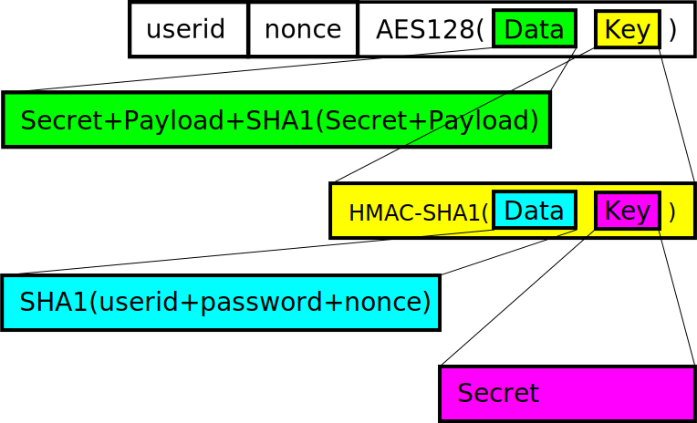

% Challenge-Response PAM Module

```
Copyright (c) 2013 Eugene Crosser

This software is provided 'as-is', without any express or implied
warranty. In no event will the authors be held liable for any damages
arising from the use of this software.

Permission is granted to anyone to use this software for any purpose,
including commercial applications, and to alter it and redistribute it
freely, subject to the following restrictions:

    1. The origin of this software must not be misrepresented; you must
    not claim that you wrote the original software. If you use this
    software in a product, an acknowledgment in the product documentation
    would be appreciated but is not required.

    2. Altered source versions must be plainly marked as such, and must
    not be misrepresented as being the original software.

    3. This notice may not be removed or altered from any source
    distribution.
```

------------------------------------------------------------------------

## Challenge-Response PAM Module for HMAC-SHA1 Hardware Token(s)

This package provides a UNIX
[PAM](http://en.wikipedia.org/wiki/Pluggable_Authentication_Modules)
module and accompanying setup program implementing
[HMAC-SHA1](http://en.wikipedia.org/wiki/HMAC-SHA1) challenge-response
user authentication with a hardware crypto token supporting
[PC/SC](http://en.wikipedia.org/wiki/PC/SC) (Smartcard) interface.

At the time of writing, I know of just one such hardware token, Yubikey
Neo from [Yubico](http://www.yubico.com/).
[Pcsclite](http://pcsclite.alioth.debian.org/) infrastructure (i.e.
the library and the daemon) is used to communicate with the token over
[CCID](http://en.wikipedia.org/wiki/Integrated_Circuit_Card_Interface_Device)
(i.e. PC/SC over USB) or
[NFC](http://en.wikipedia.org/wiki/Near_field_communication). It means
that it works equally well when you plug the token in a USB slot and if
you put it on the NFC reader.

## Theory of Challenge-Response Authentication

There are two ways to do challenge-response authentication: with shared
secret and with pre-produced response. With pre-produced response, the
host does not need to store the token's HMAC secret; on every session
conversation with the token is performed twice with different challenges.
The first response is used to decrypt stored encrypted challenge and
compare it with cleartext challenge. A new challenge is then sent
to the token, and response is used to encrypt it and store for the
future authentication session. The advantage of this approach is that
the secret is not kept anywhere other than inside the token, so the only
way to leak the secret is together with the token. The drawback is that
the response that will be expected in the next session is transferred in
cleartext in the current session, can be eavesdropped on and used in a
replay attack. This is of particular concern when using NFC. This
approach is used by the
[PAM module provided by Yubico](https://github.com/Yubico/yubico-pam).

My module uses the second approach, under which the HMAC secret is
stored both in the token and on the host. To minimize the danger of
compromise, the host copy of the shared secret is encrypted by the key
which is the expected response from the token. In the process of
authentication, token's response is used to decrypt the secret, then
this secret is used to compute the next expected token's response, and
the expected response is used to encrypt the secret again. This next
expected response is not transferred over the air, and the shared secret
stays in unencrypted form in the RAM (unless paged out) for a very short
period. The downside is that if the token is used against multiple
hosts, and the secret is leakd from one of them, all the hosts are now
compromised. This is not the case with the first approach.

The particular data structure is outlined in the picture:


## Module Operation

Authentication file, containing nonce, encrypted shared secret,
encrypted additional payload, and anciliary information, is named
according to template that can be provided both to the PAM module and
to the setup program (and must be the same, obviously). In the template
string, character '~' in the first position is substituted with the
userid's home directory, '~' in a position other than first - with the
userid itself.

Default template string is `~/.pam_cr/auth`, i.e. the file lives in the
user's home directory, in the subdirectory `.pam_cr`.

Authentication file must be initially created by the program
`pam_cr_setup` included in this package.

```
usage: pam_cr_setup [options] [username]
    -h                - show this help and exit
    -o backend-option - token option "backend:key=val"
    -f template       - template for auth state filepath
    -a secret | -A file-with-secret | -A -
                      - 40-character hexadecimal secret
    -s token-serial   - public I.D. of the token
    -n nonce          - initial nonce
    -l payload        - keyring unlock password
    -p password       - login password
    -v                - show returned data
```

The only backend option existing is "ykneo:slot=1" or "ykneo:slot=2".
Slot 2 is the default. Secret must be supplied when creating the file,
and when modifying the file in the absense of the token. Password is
used to construct the challenge. If not supplied empty string is used.
The pam module also uses empty string when given "noaskpass" argument,
so this can be used for "one factor" authentication mode (with the token
only). Payload is a string that can be optionally injected as the PAM
authentication token after successful authentication; subsequent PAM
modules like gnome keyring unlocker module will pick it up. Note that
this keyring unlocker password may be different from the login
password, and it is generally a good idea to make it so. The "returned
data" is the userid as recorded in the file and the aforementioned
payload string.

PAM module has the following parameters:

```
        verbose         write more errors to syslog.
        noaskpass       do not try to ask the user for the challenge
                        password, use empty string for the password.
        injectauth      inject payload as PAM_AUTHTOK for the benefit
                        of subsequent PAM modules.
        path=<string>   template used to find the file.
        backend:key=val backend options.
```

## Getting the Source

Check the [project homepage](http://www.average.org/chal-resp-auth/).

Pick the source tarball
[here](http://www.average.org/chal-resp-auth/pam_pcsc_cr-0.9.2.tar.xz),
or you can [clone](git://git.average.org/git/pam_pcsc_cr.git) or
[browse](http://www.average.org/gitweb/?p=pam_pcsc_cr.git;a=summary)
the git repo.

## Author

Eugene Crosser \<crosser at average dot org\>   
<http://www.average.org/~crosser/>

---
